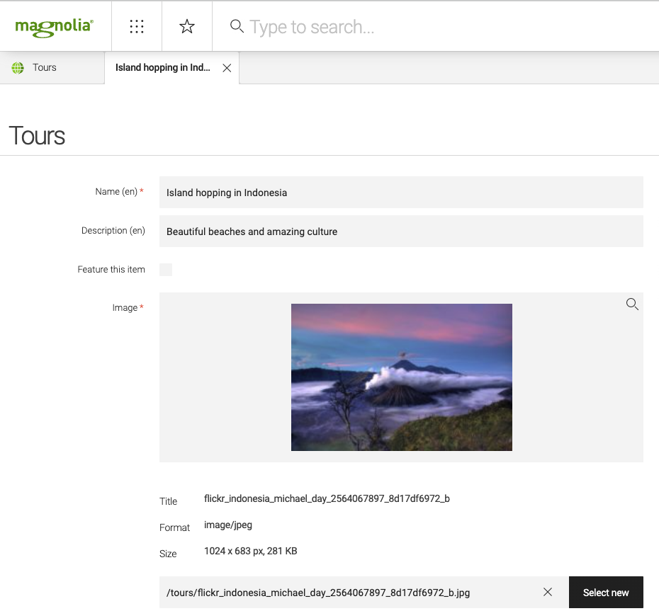
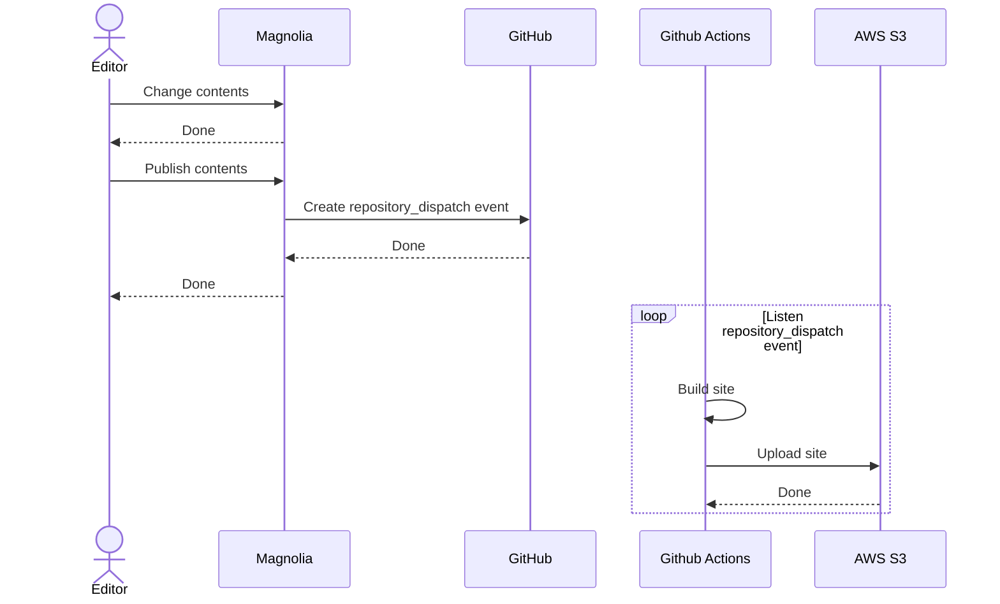

# Astro website with contents from Magnolia CMS
Example of a website built with Astro that is hydrated with contents from Magnolia CMS.  

The example creates a website for a Travel Agency especialized in tours around the world. The home page will list the tours and it will be one page by Tour that will show the detail of the tour.


> You can read this article [Static websites with Astro and Magnolia CMS](https://joaquin-alfaro.medium.com/static-websites-with-astro-and-magnolia-cms-49e0da54c5bf) to know how this example was made.


## Usage
1. 🟢 Start Magnolia CMS
```bash
docker compose up -d

open http://localhost:8080
```
> **Credentials of Magnolia**  
> *Username*: superuser  
> *Password*: superuser

The instance of Magnolia includes a content app to manage **Tours**


2. 🏗️ Build static website with Astro. The website will be created in folder `./dist`
```bash
cd astro-with-magnolia

# Install dependencies
npm install

# Build website
npm run build
```

3. 🏁 Open preview of the website
```bash
npm run preview

open http://localhost:4321
```

4. 👋🏻 Uninstall
```bash
# Remove docker container of Magnolia
docker compose down

# Remove docker volume of Magnolia
docker volume rm astro-with-magnolia_magnolia-data

# Remove docker image of Magnolia
docker rmi formentor/magnolia-cms
```

## CI/CD
Trigger GitHub Actions when contents changed in Magnolia



Groovy script executed from Magnolia to create events `repository_dispatch` in GitHub:
```groovy
import info.magnolia.init.MagnoliaConfigurationProperties
import info.magnolia.objectfactory.Components

 /* Set parameters from configuration
 ****/
configuration = Components.getComponent(MagnoliaConfigurationProperties.class);
def GITHUB_TOKEN = configuration.getProperty("magnolia.github.token")
def GITHUB_REPO = configuration.getProperty("magnolia.github.repo")
def GITHUB_OWNER = configuration.getProperty("magnolia.github.repo_owner")
def baseUrl = "https://api.github.com/repos/" + GITHUB_OWNER + "/" + GITHUB_REPO + "/dispatches"

/* Post `repository_dispatch` request to GitHub
****/
def post = new URL(baseUrl).openConnection()
post.setRequestMethod("POST")
post.setDoOutput(true)
post.setRequestProperty('Accept', 'application/vnd.github+json')
post.setRequestProperty('Authorization', "Token " + GITHUB_TOKEN)
post.setRequestProperty('X-GitHub-Api-Version', "2022-11-28")
post.getOutputStream().write('{"event_type":"contents_changed","client_payload":{"workspace":"tours"}}'.getBytes('UTF-8'));

def status_code = post.getResponseCode();
```

GitHub workflow triggered by `repository_dispatch` - see [astro-with-magnolia/.github/workflows/contents_changed.yml](./astro-with-magnolia/.github/workflows/contents_changed.yml) -

```yaml
name: 🚀 Build site when contents changed
on:
  repository_dispatch:
    types: [contents_changed]
jobs:
  deploy:
    runs-on: ubuntu-latest
    steps:
      # Checkout repository
      - name: 📥 Checkout code
        uses: actions/checkout@v4

      # Setup Node
      - name: ⚙️ Use Node.js
        uses: actions/setup-node@v4
        with:
          node-version: "20.x"

      # Install dependencies
      - name: 📦 Install dependencies
        run: npm ci
      
      # Build site
      - name: 🏗️ Build site
        run: | 
          npm run build

      # Upload site.
      - name: 🚛 Upload site
        run: |
          aws s3 sync dist/ s3://${{ vars.AWS_S3_BUCKET }} --quiet
```
