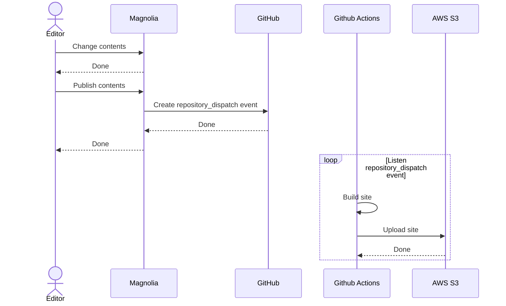
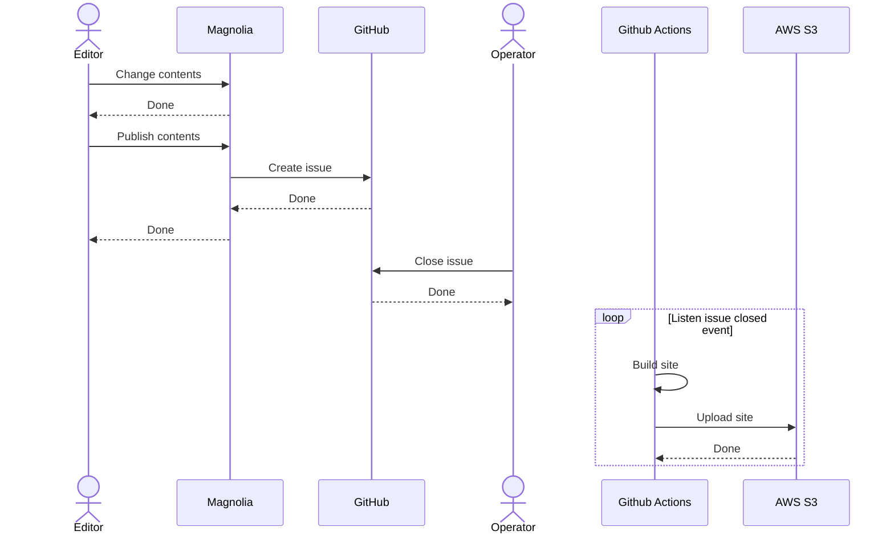

## Trigger GitHub Actions when contents changed in Magnolia

```mermaid
sequenceDiagram
    actor Editor
    participant Magnolia
    participant GitHub
    participant GitHubActions as Github Actions
    participant AWS as AWS S3
    Editor->>Magnolia: Change contents
    Magnolia-->>Editor: Done
    Editor->>Magnolia: Publish contents
    Magnolia->>GitHub: Create repository_dispatch event
    GitHub-->>Magnolia: Done
    Magnolia-->>Editor: Done
    loop Listen repository_dispatch event
        GitHubActions->>GitHubActions: Build site
        GitHubActions->>AWS: Upload site
        AWS-->>GitHubActions: Done
    end
```

## Create issue in GitHub when contents changed in Magnolia

```mermaid
sequenceDiagram
    actor Editor
    participant Magnolia
    participant GitHub
    actor Operator
    participant GitHubActions as Github Actions
    participant AWS as AWS S3
    Editor->>Magnolia: Change contents
    Magnolia-->>Editor: Done
    Editor->>Magnolia: Publish contents
    Magnolia->>GitHub: Create issue
    GitHub-->>Magnolia: Done
    Magnolia-->>Editor: Done
    Operator->>GitHub: Close issue
    GitHub-->>Operator: Done
    loop Listen issue closed event
        GitHubActions->>GitHubActions: Build site
        GitHubActions->>AWS: Upload site
        AWS-->>GitHubActions: Done
    end
```
